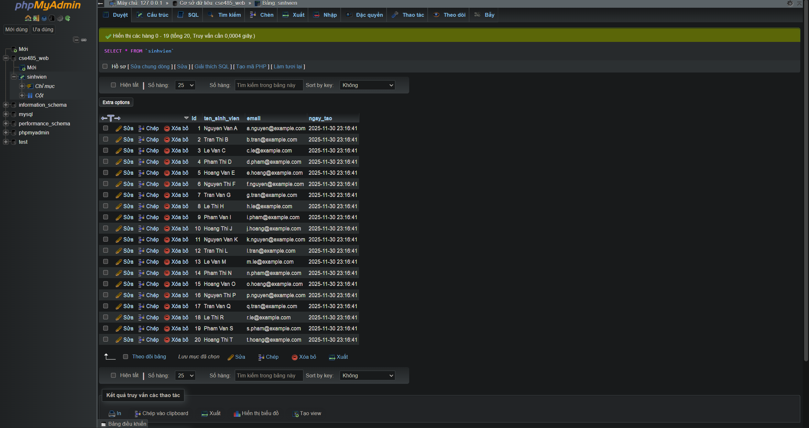

Ảnh phpMyAdmmin:

Ảnh web (Trước khi thêm):

Ảnh web (Sau khi thêm sinh viên):

Câu hỏi phản biện: Tại sao không nên trực tiếp nối biến PHP vào câu lệnh SQL ($sql = "SELECT * FROM users WHERE id = $id")? Prepared Statement trong PDO ngăn chặn SQL Injection bằng cách gì?